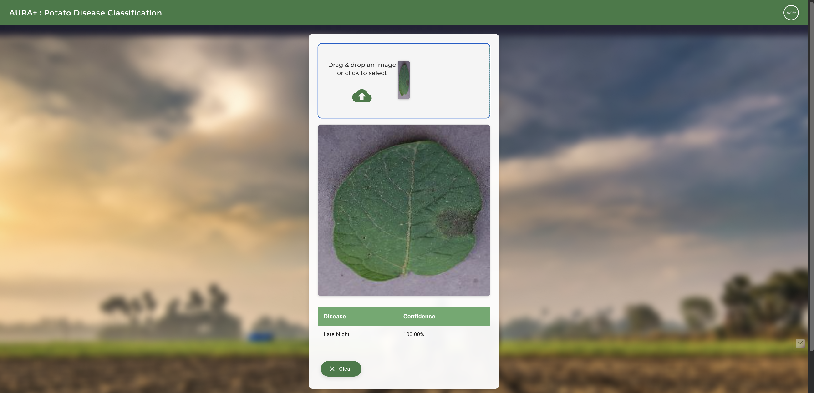
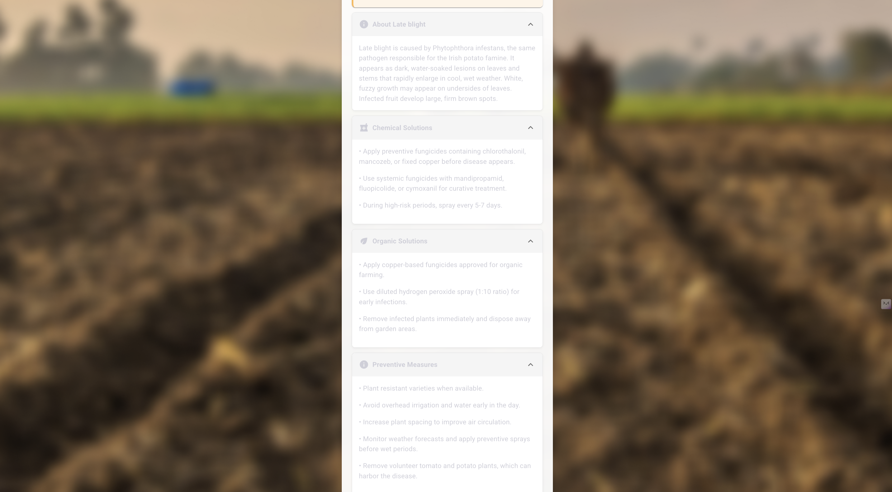

# 🥔 Potato Disease Classification 🥔

  
  

  <h3>Detect Early Blight, Late Blight, and Healthy Potato Plants with Deep Learning</h3>

  
  
  
  
  

## 🌱 Overview

This project uses deep learning to classify potato plant diseases from images. Our model can identify:

- 🦠 **Early Blight** - Caused by _Alternaria solani_
- 🍄 **Late Blight** - Caused by _Phytophthora infestans_
- ✅ **Healthy** - Normal potato plants

Early detection of these diseases can help farmers take immediate action, potentially saving entire potato crops from devastation!

  

## 🔬 Why It Matters

Potato diseases cause billions in economic losses yearly. By the time symptoms are visible to the naked eye, it's often too late:

- Late blight can destroy entire fields in just a few days
- Early blight reduces yields by 20-30%
- Both diseases spread rapidly in humid conditions

Our tool helps farmers identify diseases at early stages when they're still treatable!

